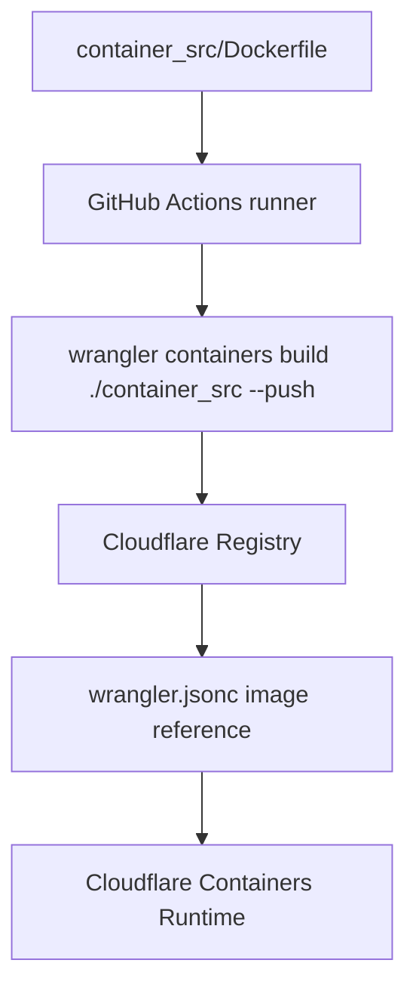

# custom-container-demo

Cloudflare Containers에서 커스텀 이미지를 쓰는 최소 레시피 프로젝트입니다. 핵심은 개발 서버를 켤 때마다 로컬에서 Dockerfile을 다시 빌드하지 않도록, 이미지는 GitHub Actions에서 빌드하고 Cloudflare Registry에 저장하는 것입니다.

## 이 프로젝트가 보여주는 흐름

1. Cloudflare Containers C3 템플릿에서 시작한다.
2. 컨테이너 빌드 문맥은 `container_src/`에 둔다.
3. GitHub Actions에서 컨테이너 이미지를 빌드한다.
4. Wrangler로 Cloudflare Registry에 이미지를 푸시한다.
5. `wrangler.jsonc`는 `registry.cloudflare.com/...` 이미지를 참조한다.
6. 이후 `wrangler dev` 또는 `wrangler deploy`는 이미 빌드된 이미지를 사용한다.



## 가장 중요한 경계

Cloudflare Registry는 이미지를 저장하고, Cloudflare Containers는 이미지를 실행합니다. 하지만 Cloudflare를 일반적인 원격 Docker 빌드 서버처럼 보면 안 됩니다.

`wrangler.jsonc`가 로컬 Dockerfile을 가리키면 Wrangler가 실행되는 환경의 Docker 엔진으로 이미지를 빌드할 수 있습니다. 개발 서버 실행 때마다 이 빌드 경로를 밟지 않으려면, 이미지는 GitHub Actions에서 미리 빌드하고 Cloudflare Registry에 올려둡니다.

## 프로젝트 구조

```text
custom-container-demo/
  src/
    index.ts                 # Worker 게이트웨이와 Container 컨트롤러 클래스
  container_src/
    Dockerfile               # 컨테이너 이미지 레시피
    .dockerignore            # Docker build context 정리
    package.json             # 컨테이너 서버 의존성
    pnpm-lock.yaml           # 컨테이너 의존성 lockfile
    server.js                # 3000번 포트 Express 서버
  .github/workflows/
    container-image.yml      # CI 이미지 빌드/푸시
  wrangler.jsonc             # Worker와 Containers 설정
  package.json               # 루트 스크립트와 Worker 의존성
  pnpm-lock.yaml             # 루트 lockfile
```

## 준비물

- Node.js 24
- `package.json`의 `packageManager` 기준 pnpm
- 로컬 Cloudflare 명령을 위한 Wrangler 인증
- GitHub repository secrets:
  - `CLOUDFLARE_API_TOKEN`
  - `CLOUDFLARE_ACCOUNT_ID`

## 설치

```sh
pnpm install --frozen-lockfile
```

## 실행 구조: 게이트웨이와 컨테이너 컨트롤러

`src/index.ts`에는 성격이 다른 두 역할이 같이 들어 있다.

| 코드 | 역할 | 하는 일 |
| --- | --- | --- |
| `MyContainer extends Container<Env>` | 컨테이너 컨트롤러 | 실제 컨테이너 인스턴스를 어떻게 시작·중지·설정·프록시할지 정한다. `defaultPort`, `sleepAfter`, 환경변수, lifecycle hook을 가진다. |
| `app` / Worker `fetch` 엔트리포인트 | 게이트웨이 | 외부 HTTP 요청을 받고 어떤 컨테이너 인스턴스에 보낼지 고른다. 이 demo에서는 작은 pool에서 컨테이너 하나를 골라 일반 트래픽을 프록시한다. |

즉, 컨테이너 클래스는 앱 서버 자체가 아니라 실제 컨테이너를 제어하는 Worker 쪽 컨트롤러다. Cloudflare Containers 서비스에서 Worker 엔트리포인트는 `n`개의 컨테이너 앞단에 서는 게이트웨이로 보면 된다.

## 컨테이너 이미지 빌드/푸시

루트 스크립트는 다음 형태입니다.

```json
{
  "scripts": {
    "image:push": "wrangler containers build ./container_src -t simple-node-health:dev --push"
  }
}
```

로컬 Docker 엔진으로 직접 빌드/푸시하려면 다음을 실행합니다.

```sh
pnpm run image:push
```

하지만 이 레시피의 권장 흐름은 GitHub Actions입니다.

```sh
pnpm run image:push:gh
```

또는 GitHub Actions 화면에서 **Container image** workflow를 수동 실행합니다.

## GitHub Actions 순서

pnpm 버전은 루트 `package.json`의 `packageManager`에서만 정합니다.

```yaml
- uses: actions/checkout@v5

- uses: pnpm/action-setup@v4
  with:
    run_install: false

- uses: actions/setup-node@v5
  with:
    node-version: 24
    cache: pnpm

- run: pnpm install --frozen-lockfile

- run: pnpm run image:push
```

루트 `package.json`에 `packageManager`가 있으면 `pnpm/action-setup`에 `version:`을 또 적지 않습니다. 두 군데에 pnpm 버전을 적으면 `Multiple versions of pnpm specified` 에러가 납니다.

## 빌드된 이미지 사용

이미지가 Cloudflare Registry에 올라가면 `wrangler.jsonc`가 Registry 이미지를 참조하게 합니다.

```jsonc
{
  "containers": [
    {
      "class_name": "MyContainer",
      "image": "registry.cloudflare.com/<account-id>/simple-node-health:dev",
      "instance_type": "lite",
      "max_instances": 1
    }
  ]
}
```

이 demo repo에는 실제 account id가 들어간 이미지 주소가 커밋될 수 있습니다. 자기 계정에서 재사용할 때는 `registry.cloudflare.com/<account-id>/<image>:<tag>` 값을 본인 계정 기준으로 바꿉니다.

## 개발 서버 실행

```sh
pnpm dev
```

유용한 route:

- `GET /_gateway/health` — Worker 게이트웨이가 직접 처리한다. gateway 상태와 pool 크기를 반환한다.
- `GET /` — Worker 게이트웨이를 지나 컨테이너 서버로 프록시된다. `hello from Cloudflare container`를 반환한다.
- `GET /health` — Worker 게이트웨이를 지나 컨테이너 서버로 프록시된다. `{ "ok": true }`를 반환한다.

컨테이너 서버는 `3000`번 포트에서 listen하고, `MyContainer.defaultPort`도 `3000`입니다.

## 로컬 검증

```sh
pnpm install --frozen-lockfile
pnpm exec tsc --noEmit

cd container_src
pnpm install --prod --frozen-lockfile
docker build . -t simple-node-health:test
```

## 주의사항

- `wrangler containers build [PATH]`의 `[PATH]`는 Dockerfile 파일이 아니라 Dockerfile이 들어 있는 디렉터리입니다. 이 repo에서는 `./container_src`를 씁니다.
- 이 레시피는 pnpm만 씁니다. `package-lock.json`과 `pnpm-lock.yaml`을 섞지 않습니다.
- Cloudflare API token은 GitHub Actions secret이나 Cloudflare secret 저장소에 둡니다. Docker image 안에 넣지 않습니다.
- `container_src/.dockerignore`는 불필요한 파일이 Docker build context에 들어가지 않게 막습니다.

## 참고

- [Cloudflare Containers docs](https://developers.cloudflare.com/containers/)
- [Image Management](https://developers.cloudflare.com/containers/platform-details/image-management/)
- [Local Development](https://developers.cloudflare.com/containers/local-dev/)
- [`wrangler containers` commands](https://developers.cloudflare.com/workers/wrangler/commands/containers/)
