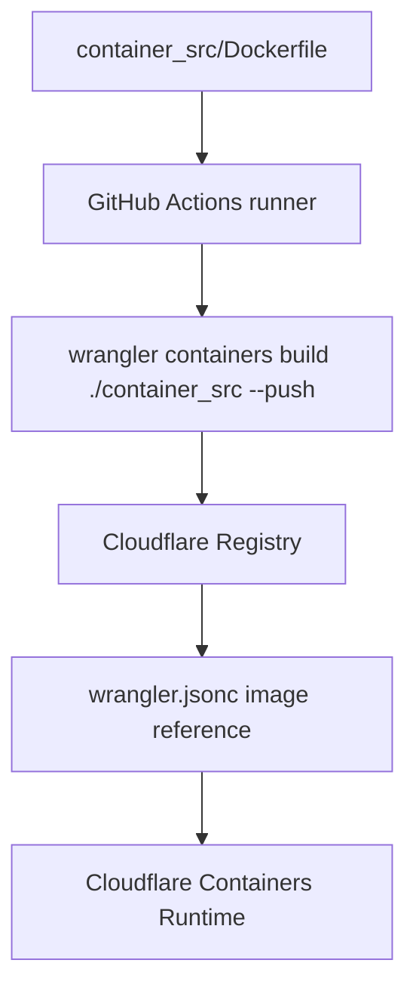

# custom-container-demo

A minimal Cloudflare Containers recipe project that uses a prebuilt container image from Cloudflare Registry instead of rebuilding the Dockerfile every time local development starts.

For Korean instructions, see [README.ko.md](./README.ko.md).

## What this demonstrates

1. Start from the Cloudflare Containers C3 template.
2. Keep the container build context in `container_src/`.
3. Build the container image in GitHub Actions.
4. Push the built image to Cloudflare Registry with Wrangler.
5. Point `wrangler.jsonc` at the `registry.cloudflare.com/...` image.
6. Run `wrangler dev` or `wrangler deploy` without repeatedly building the Dockerfile on the developer machine.



## Important boundary

Cloudflare Registry stores container images and Cloudflare Containers runs them. It is not a generic remote Docker build service for local development.

If `wrangler.jsonc` points to a local Dockerfile, Wrangler may build that Dockerfile with the Docker engine available where Wrangler is running. To avoid rebuilding on every local dev cycle, this project builds the image in GitHub Actions and stores the result in Cloudflare Registry.

## Project layout

```text
custom-container-demo/
  src/
    index.ts                 # Worker and Container binding routes
  container_src/
    Dockerfile               # Container image recipe
    .dockerignore            # Keeps build context small
    package.json             # Container server dependencies
    pnpm-lock.yaml           # Container dependency lockfile
    server.js                # Express server listening on port 3000
  .github/workflows/
    container-image.yml      # CI image build and push
  wrangler.jsonc             # Worker and Containers config
  package.json               # Worker dependencies and scripts
  pnpm-lock.yaml             # Root dependency lockfile
```

## Prerequisites

- Node.js 24
- pnpm, via the `packageManager` field in `package.json`
- Wrangler authentication for local Cloudflare commands
- GitHub repository secrets:
  - `CLOUDFLARE_API_TOKEN`
  - `CLOUDFLARE_ACCOUNT_ID`

## Install

```sh
pnpm install --frozen-lockfile
```

## Build and push the container image

The root script is:

```json
{
  "scripts": {
    "image:push": "wrangler containers build ./container_src -t simple-node-health:dev --push"
  }
}
```

Run it locally only when you intentionally want to use the local Docker engine:

```sh
pnpm run image:push
```

The preferred recipe path is GitHub Actions:

```sh
pnpm run image:push:gh
```

Or run the **Container image** workflow manually in GitHub Actions.

## GitHub Actions workflow

The workflow uses pnpm consistently and lets `package.json` define the pnpm version.

```yaml
- uses: actions/checkout@v5

- uses: pnpm/action-setup@v4
  with:
    run_install: false

- uses: actions/setup-node@v5
  with:
    node-version: 24
    cache: pnpm

- run: pnpm install --frozen-lockfile

- run: pnpm run image:push
```

Do not also set `version:` in `pnpm/action-setup` when the root `package.json` already has a `packageManager` value such as `pnpm@10.33.2+sha512...`.

## Use the prebuilt image

After the image is pushed, `wrangler.jsonc` should reference the Cloudflare Registry image:

```jsonc
{
  "containers": [
    {
      "class_name": "MyContainer",
      "image": "registry.cloudflare.com/<account-id>/simple-node-health:dev",
      "instance_type": "lite",
      "max_instances": 1
    }
  ]
}
```

The committed demo may contain a real account-specific image reference. For your own account, replace it with your own `registry.cloudflare.com/<account-id>/<image>:<tag>` value.

## Run the Worker

```sh
pnpm dev
```

Useful routes:

- `GET /` — list example routes
- `GET /singleton` — route to one container instance
- `GET /container/<id>` — route to a named container instance
- `GET /lb` — route to one of several container instances

The container server listens on port `3000`, and `MyContainer.defaultPort` is also `3000`.

## Verify locally

```sh
pnpm install --frozen-lockfile
pnpm exec tsc --noEmit

cd container_src
pnpm install --prod --frozen-lockfile
docker build . -t simple-node-health:test
```

## Notes

- `wrangler containers build [PATH]` expects the directory containing the Dockerfile. For this project, use `./container_src`.
- Keep npm and pnpm lockfiles separate. This recipe uses pnpm only.
- Keep secrets in GitHub Actions secrets or Wrangler/Cloudflare secret storage. Do not bake tokens into the Docker image.
- `container_src/.dockerignore` prevents unnecessary local files from entering the Docker build context.

## References

- [Cloudflare Containers docs](https://developers.cloudflare.com/containers/)
- [Image Management](https://developers.cloudflare.com/containers/platform-details/image-management/)
- [Local Development](https://developers.cloudflare.com/containers/local-dev/)
- [`wrangler containers` commands](https://developers.cloudflare.com/workers/wrangler/commands/containers/)
